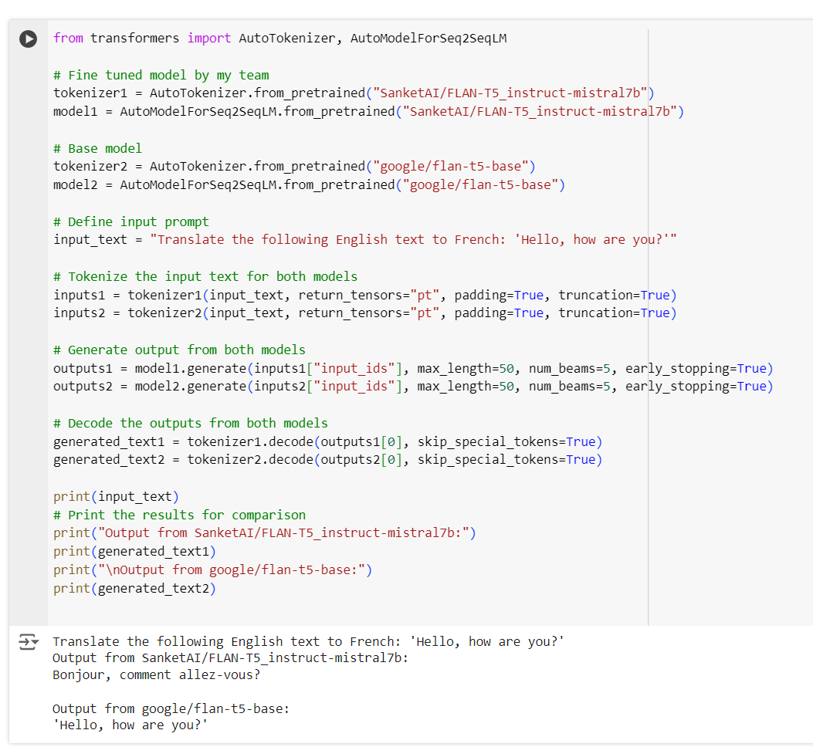
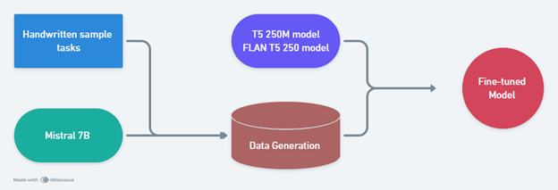

# Instruction-Tuning-from-Synthetic-Data

## Introduction
Large language models like ChatGPT and Claude offer exceptional performance in instruction-following tasks but often suffer from large sizes and high latency, making them challenging to deploy for local or academic use. This project addresses the need for smaller, low-latency models that can perform similarly to their larger counterparts. By fine-tuning a small pre-trained model (T5-Base 250M) using synthetic data generated from the larger Mistral 7B model, we aim to improve performance in instruction-following tasks while maintaining the benefits of smaller model sizes, including reduced computational requirements and faster response times.

## Solution
To mitigate the issues posed by large models, we implement instruction tuning for the T5-Base model. This process involves using data generated by the Mistral 7B model to fine-tune the smaller T5-Base model, aiming to improve its accuracy on instruction-based tasks. Fine-tuning is performed in a supervised manner, where the model is trained to predict each token in the output sequence based on the input and instruction.

# Project Demo

The project demo is available in the Jupyter Notebook file [`demo.ipynb`](demo.ipynb).

### Instruction-Following Comparison: Fine-Tuned Model vs Base Model

As we can see, our fine-tuned model follows the instruction and translates the text into French, while the base model fails to follow the instruction properly.




## Instruction Tuning Process
The instruction tuning process follows these steps:
1. **Data Preparation**: Use the synthetic data generated by the Mistral 7B model based on a set of 175 seed tasks.
2. **Fine-tuning**: Fine-tune the T5-Base model using the provided dataset, employing the framework and code from `declare-lab` on GitHub.
3. **Training Parameters**: Fine-tuning is performed with the following setup:
   - **Platform**: Kaggle (for initial 3 epochs, taking 5 hours)
   - **Alternative Platform**: Param-Karmapa (for 5 epochs, taking 3 hours)
### Outline of Project 


## Results

### Benchmark Evaluation
We evaluated the fine-tuned T5-Base model using two main benchmarks:

1. **Big Bench Hard (BBH)**: 
   - **Before Fine-tuning**: T5-Base accuracy = 27.8%
   - **After Fine-tuning**: T5-Base accuracy = 17.2%
   
   After fine-tuning, the accuracy drops, likely due to the lack of diversity in the data used for fine-tuning.

2. **Massive Multitask Language Understanding (MMLU)**:
   - **Before Fine-tuning**: T5-Base accuracy = 25.7%
   - **After Fine-tuning**: T5-Base accuracy = 26.4%
   
   Fine-tuning slightly improved accuracy on MMLU tasks, which evaluate models across 57 subjects, ranging from elementary to advanced levels.

### Flan-T5-Base Evaluation (Google’s Pre-fine-tuned Model)
For comparison, the FLAN-T5-Base model, already fine-tuned by Google, was evaluated on the same benchmarks:
- **Big Bench Hard (BBH)**:
   - **Before Fine-tuning**: FLAN-T5-Base accuracy = 31.3%
   - **After Fine-tuning**: FLAN-T5-Base accuracy = 27.29%
- **MMLU**:
   - **Before Fine-tuning**: FLAN-T5-Base accuracy = 35.9%
   - **After Fine-tuning**: FLAN-T5-Base accuracy = 32.4%

### Performance Summary:

| Model/Benchmark | Big Bench Hard (BBH) | MMLU |
|-----------------|----------------------|------|
| **T5-Base (~250M)** (Before Fine-tuning) | 27.8% | 25.7% |
| **T5-Base (~250M)** (After Fine-tuning) | 17.2% | 26.4% |
| **Flan-T5-Base (~250M)** (Before Fine-tuning) | 31.3% | 35.9% |
| **Flan-T5-Base (~250M)** (After Fine-tuning) | 27.29% | 32.4% |

## Limitations
1. **Noisy Data**: The synthetic data generated by Mistral 7B lacks diversity and linguistic complexity, resulting in a drop in model performance, particularly on the BBH benchmark.
2. **Noise in Target Model**: Mistral 7B, being smaller than larger models, generates inconsistent and noisy data, making it difficult to fully filter and clean the data used for fine-tuning.
3. **Size of T5-Base Model**: With only 250 million parameters, T5-Base may struggle to handle the complexity of the tasks in the benchmarks, which may require a larger model for better performance.

## Conclusion
Fine-tuning the T5-Base model with synthetic data generated from Mistral 7B improves its performance on some benchmarks but also reveals the limitations of using smaller models for complex tasks. While the model performs better on MMLU after fine-tuning, its performance on BBH decreases due to the noisy and non-diverse data used for fine-tuning. Future work can explore improving the data generation process or using more powerful models to generate training data for better results.

## Usage

To use this model in your own projects:

1. Install the required libraries:

   ```bash
   pip install transformers torch

2. Load the Fine-tuned Model and Tokenizer:

  ```python
    from transformers import AutoTokenizer, AutoModelForSeq2SeqLM

    tokenizer = AutoTokenizer.from_pretrained("SanketAI/FLAN-T5_instruct-mistral7b")
    model = AutoModelForSeq2SeqLM.from_pretrained("SanketAI/FLAN-T5_instruct-mistral7b")
  ```


  3. Tokenize and Generate Text:

  ```python
  input_text = "Translate the following English text to French: 'Hello, how are you?'"
  inputs = tokenizer(input_text, return_tensors="pt", padding=True, truncation=True)
  outputs = model.generate(inputs["input_ids"], max_length=50, num_beams=5, early_stopping=True)
  generated_text = tokenizer.decode(outputs[0], skip_special_tokens=True)
  print(generated_text)
  ```


